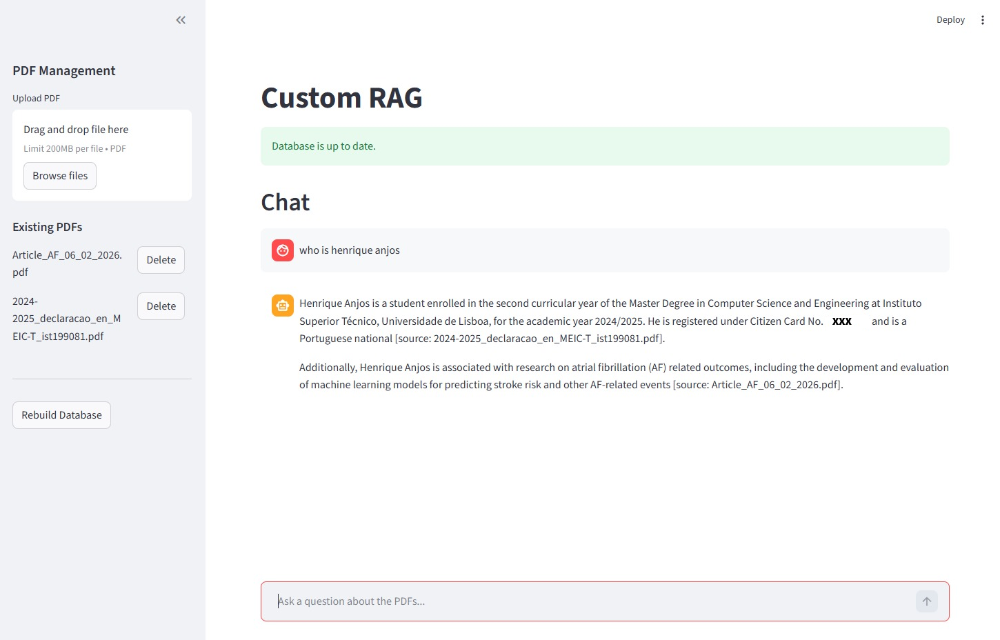

# RAG Chatbot Application

A modular Retrieval-Augmented Generation (RAG) chatbot that enables semantic search over custom documents.  
The system uses embedding-based retrieval, a vector database for similarity search, a local LLM served via Ollama, and a Streamlit UI for interaction. The entire stack can be run locally or via Docker.




## Architecture Overview

The project follows a modular structure:

- **Ingestion Pipeline**  
  - Document loading  
  - Text chunking  
  - Embedding generation  
  - Storage in vector database  

- **Retrieval Layer**  
  - Semantic search over vector store  
  - Source-aware document retrieval  

- **Generation Layer**  
  - Local LLM (via Ollama)  
  - Context-augmented response generation  

- **Frontend**  
  - Streamlit UI for real-time interaction  

- **Deployment**  
  - Docker + Docker Compose support  
  - Reproducible environment configuration  

---

## Tech Stack

- Python  
- Streamlit  
- Qdrant (vector database)  
- Ollama (local LLM serving)  
- Docker / Docker Compose  
- Makefile for task automation  

---

## Project Structure

```
app.py
src/
├── pipeline.py
├── ingestion/
├── rag/
└── vectorstore/
data/
├── raw/
├── processed/
└── vectorstore/
docker-compose.yml
Dockerfile
requirements.txt
README.md
Makefile
```


---

## Running Locally

### 1. Pull the required model

```bash
make pull-model
```

### 2. Build or rebuild the pipeline

```bash
make rebuild
```

### 3. Run the Streamlit app

```bash
make run
```

## Docker Usage

### 1. Build and Run

```bash
make docker-build
```

or 

```bash
make docker-run
```

### 2. Run the Streamlit app

```bash
make pull-model-docker
```